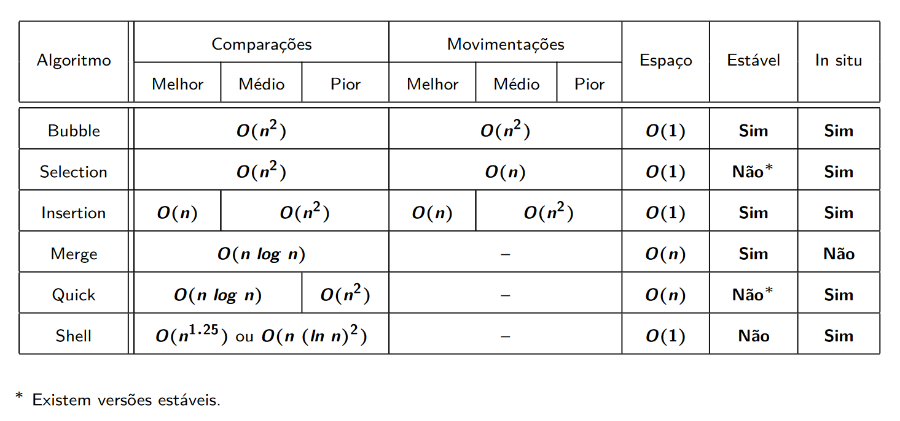

# Análise De Desempenho de Algoritmos de Ordenação




> A aplicação tem como objetivo testar o desempenho de diversos algoritmos de ordenação em diferentes cenários, gerando gráficos que facilitam a compreensão dos resultados obtidos. Com isso, será possível realizar uma análise comparativa dos algoritmos e fornecer insights detalhados sobre a eficiência de cada um, os quais serão apresentados em um artigo informativo.

## 💻 Feito Com:


## 📖 Documentação

- [Artigo - Em desenvolvimento](#)

## 💻 Pré-requisitos

Antes de começar, verifique se você atendeu aos seguintes requisitos:

- [`< Git >`](https://git-scm.com/)
- [`< NodeJS >`](https://nodejs.org/)

## 📥 Baixando o Projeto

Para clonar e baixar as dependências do projeto, utilize os comandos:

```
git clone https://github.com/pumba-dev/sorting-algorithms-comparison.git

cd sorting-algorithms-comparison

npm install
```

## 📝 Adicionando e Referênciando Novo Algoritmo

- ### Adicionando Novo Algoritmo

  Para adicionar um novo algoritmo, basta colocá-lo na pasta `./algorithms`, que está localizada no diretório raiz do projeto. O algoritmo deve receber apenas uma lista como parâmetro e retornar a lista ordenada.

- ### Criando Referência

  Para criar uma referência ao algoritmo, é necessário adicionar um novo item ao objeto no arquivo [`./algorithms/algorithms-setup.js`](./algorithms/algorithms-setup.js). A chave representa o nome que será utilizado para identificar o algoritmo, enquanto o valor será um objeto contendo os atributos 'label' e 'function', que armazenam o nome e o código do algoritmo, respectivamente. Dessa forma, o arquivo de configuração reconhecerá o algoritmo corretamente.

## ⚙️ Configurando Simulação

Para configurar os cenários de simulação altere os parametros do arquivo [`simulation-config.json`](/simulation-config.json) no diretório raiz do projeto.

| Params            | Type   | Description                                                                                  |
| ----------------- | ------ | -------------------------------------------------------------------------------------------- |
| `replications`    | Number | Quantidade de replicações da simulação pra se tirar a média dos resultados                   |
| `loadBalances`    | Number | Quantidade de entradas diferentes que serão usadas na simulação                              |
| `minBalanceValue` | Number | Tamanho da entrada do primeiro ponto de carga                                                |
| `maxBalanceValue` | Number | Tamanho da entrada do último ponto de carga (somente para tipo distribuido de balanceamento) |
| `balanceType`     | String | Modelo de geração das entradas que serão usadas na simulação (distributed ou exponential)    |
| `algorithms`      | Array  | Nome dos algoritmos que serão utilizados na simulação                                        |

### Balance Types

O tipo de balanceamento define o modelo de crescimento utilizado para gerar as entradas das simulações.

- #### Distribuído

  No modelo de crescimento distribuído, os algoritmos são testados para valores de entrada com incrementos constantes. Ou seja, o tamanho da entrada varia em progressão aritmética.

  Exemplo:

  ```
  [100, 200, 300, 400, 500, 600, 700, 800, ...]
  ```

- #### Exponencial

  No modelo de crescimento exponencial, os algoritmos são testados para valores de entrada com incrementos exponencialmente maiores que o anterior. Ou seja, o tamanho da entrada varia em progressão geométrica.

  Exemplo:

  ```
  [128, 256, 512, 1024, 2048, 4096, 8192, 16384, ...]
  ```

## 🚀 Iniciando Simulação

Para iniciar a simulação, utilize o comando:

```
npm run start
```

Se a simulação for iniciada com sucesso, uma barra de progresso será exibida para acompanhar seu andamento. Após a conclusão das simulações, os resultados serão processados e convertidos em gráficos, que serão salvos na pasta [`./results`](./results) do projeto.

## 📫 Contribuindo com o Projeto

Para contribuir com o projeto, siga estas etapas:

1. Bifurque este repositório.
2. Crie um branch: `git checkout -b <nome_branch>`.
3. Faça suas alterações e confirme-as: `git commit -m '<mensagem_commit>'`
4. Envie para o branch original: `git push origin main`
5. Crie a solicitação de pull.

Como alternativa, consulte a documentação do GitHub em [como criar uma solicitação pull](https://help.github.com/en/github/collaborating-with-issues-and-pull-requests/creating-a-pull-request).

## 🤝 Colaboradores

As seguintes pessoas contribuíram para este projeto:

<table>
  <tr>
  <!-- Pumba Developer -->
    <td align="center">
      <a href="https://github.com/pumba-dev">
        <br>
        <sub>
          <b>Pumba Developer</b>
        </sub>
      </a>
    </td>
        <!-- Carlos Menezes -->
    <td align="center">
      <a href="https://github.com/DevUnusual">
        <br>
        <sub>
          <b>Carlos Menezes</b>
        </sub>
      </a>
    </td>
    <!-- Gabriel Reis -->
    <td align="center">
      <a href="https://github.com/usernamegran">
        <br>
        <sub>
          <b>Gabriel Reis</b>
        </sub>
      </a>
    </td>
  </tr>
</table>

## 💰 Donate

[](https://picpay.me/pumbadev)

## 📝 Licença

Copyright © 2023 Pumba Developer

[⬆ Voltar ao topo](#)<br>
